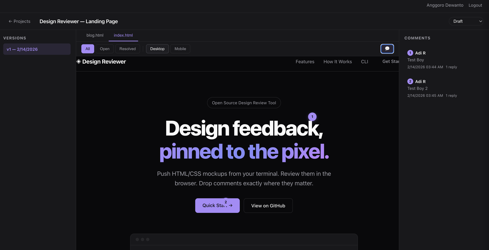

# Design Reviewer

A collaborative tool for reviewing UI/UX design mockups. Designers push HTML+CSS mockups via CLI to a web app where teams can view designs and leave pin-point annotations.



## Features

- Push HTML/CSS design mockups from the command line
- View rendered designs in the browser with version history
- Pin comments on specific coordinates of a design
- Google OAuth authentication
- Status workflow for review tracking

## Project Structure

```
├── cmd/
│   ├── server/          # Web server entrypoint
│   └── cli/             # CLI tool entrypoint
├── internal/
│   ├── api/             # HTTP handlers and middleware
│   ├── auth/            # Google OAuth logic
│   ├── cli/             # CLI commands (login, push, init)
│   ├── db/              # SQLite database layer
│   └── storage/         # File storage for uploads
├── web/
│   ├── templates/       # HTML templates
│   └── static/          # CSS and JavaScript
├── scripts/             # Deployment scripts
├── docs/                # Specs and phase docs
├── Dockerfile
└── fly.toml
```

## Prerequisites

- Go 1.22+ with GCC (CGO required for SQLite)
- Google OAuth credentials (see Quick Start)

## Quick Start

### 1. Clone and install dependencies

```bash
git clone https://github.com/ab/design-reviewer.git
cd design-reviewer
go mod download
```

### 2. Create Google OAuth credentials

1. Go to the [Google Cloud Console](https://console.cloud.google.com/)
2. Create a new project or select an existing one
3. Navigate to **APIs & Services → Credentials**
4. Click **Create Credentials → OAuth client ID**
5. If prompted, configure the OAuth consent screen first:
   - Choose **External** user type
   - Fill in the app name and your email
   - Add scope: `openid`, `email`, `profile`
   - Add your email as a test user
6. Back in Credentials, click **Create Credentials → OAuth client ID**
7. Select **Web application**
8. Under **Authorized redirect URIs**, add: `http://localhost:8080/auth/google/callback`
9. Click **Create** and note the **Client ID** and **Client Secret**

### 3. Configure environment

```bash
cp .env.template .env
```

Edit `.env` with your values:

```
GOOGLE_CLIENT_ID=your-client-id
GOOGLE_CLIENT_SECRET=your-client-secret
SESSION_SECRET=generate-with-openssl-rand-base64-32
BASE_URL=http://localhost:8080
```

Generate a session secret:

```bash
openssl rand -base64 32
```

### 4. Run the server

```bash
go run ./cmd/server --port 8080 --db ./data/design-reviewer.db --uploads ./data/uploads
```

Open http://localhost:8080 in your browser.

### 5. Build and use the CLI

```bash
go build -o design-reviewer ./cmd/cli

# Authenticate with the server
./design-reviewer login --server http://localhost:8080

# Push a design mockup
./design-reviewer push ./my-mockup --name "Homepage Redesign" --server http://localhost:8080
```

## Mockup Directory Structure

The directory you push must contain at least one `.html` file. If an `index.html` is present, it will be used as the default page. CSS, JavaScript, images, and other assets are supported via relative paths.

```
my-mockup/
├── index.html          # Default page (recommended)
├── about.html          # Additional pages (optional)
├── style.css
└── images/
    └── logo.png
```

Each `.html` file becomes a reviewable page in the viewer. You can scaffold a starting point with:

```bash
./design-reviewer init ./my-mockup
```

## CLI Commands

| Command | Description |
|---------|-------------|
| `login --server URL` | Authenticate via Google OAuth |
| `logout` | Remove stored credentials |
| `push <dir> --name <name> --server URL` | Upload a design directory |
| `init [dir]` | Generate a `DESIGN_GUIDELINES.md` template |

## For Designers (CLI-Only Setup)

If your team already has a server running, you just need the CLI binary.

### 1. Download

Grab the latest binary for your platform from [Releases](https://github.com/anggorodewanto/design-reviewer/releases).

On macOS/Linux, make it executable:

```bash
chmod +x design-reviewer-*
mv design-reviewer-* /usr/local/bin/design-reviewer
```

### 2. Log in

```bash
design-reviewer login --server https://your-server-url
```

This opens your browser for Google sign-in. Once authenticated, you're ready to push designs.

### 3. Push a design

Create a directory with your HTML/CSS mockup (must contain at least one `.html` file), then:

```bash
design-reviewer push ./my-mockup --name "Homepage Redesign" --server https://your-server-url
```

Use `design-reviewer init ./my-mockup` to generate a starter template with design guidelines.

## Deployment (Fly.io)

```bash
# First-time setup
fly launch

# Set secrets
fly secrets set GOOGLE_CLIENT_ID=... GOOGLE_CLIENT_SECRET=... SESSION_SECRET=...

# Deploy
fly deploy
```

Update the Google OAuth redirect URI to match your Fly.io URL (e.g., `https://design-reviewer.fly.dev/auth/google/callback`).

## Running Tests

```bash
go test ./...
```

## Contributing

1. Fork the repository
2. Create a feature branch (`git checkout -b feature/my-feature`)
3. Commit your changes (`git commit -am 'Add my feature'`)
4. Push to the branch (`git push origin feature/my-feature`)
5. Open a Pull Request

## License

This project is licensed under the MIT License - see the [LICENSE](LICENSE) file for details.
